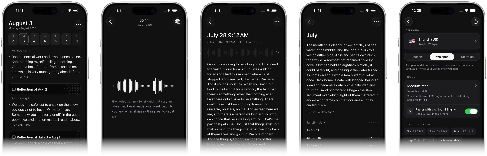

<picture>
  <source media="(prefers-color-scheme: dark)" srcset="assets/readme/banner-dark.svg">
  
</picture>

<br/>

<p>
  <a href="pubspec.yaml"></a>
  <a href="pubspec.yaml"></a>
  <a href="LICENSE"></a>
  <a href="ios/"></a>
</p>

opentranscribe is a voice journal for iOS. Recording, transcription, reflection, and storage all happen on the device. There is no account, no sync, and no telemetry. The one connection the app ever opens is the download of a Whisper model you pick (and its Neural Engine encoder, if you switch that on), from a single pinned host; it sends nothing, and everything else works the same with the phone in airplane mode. The optional supporter purchase goes through StoreKit: the OS talks to the App Store, no journal content is in that conversation, and only the act of buying needs a connection.

It is on the [App Store](https://apps.apple.com/app/opentranscribe/id6794718941). [opentranscribe.xyz](https://opentranscribe.xyz) shows it at work: the recorder on that page is the app's own recording screen ported to the web, playing the take the onboarding plays. The site's source is in [`web/`](web/).



Transcription and reflection sit behind swappable contracts, `TranscriptionEngine` and `ReflectionEngine`, shipped as the app-owned plugins [`packages/transcriber`](packages/transcriber/) and [`packages/reflections`](packages/reflections/). An engine that does not declare itself on-device is refused at construction. Three transcription engines ship, chosen on the transcription screen: Apple's SpeechAnalyzer, the system dictation recognizer, and whisper.cpp, which serves every language from one downloaded model of your choice on any iPhone. Recordings and entries stay encrypted in the app's own storage. An entry can be continued: a later take merges into its recording on the device and is transcribed onto the end of the transcript. [CONTRIBUTING.md](CONTRIBUTING.md) covers how it fits together and how to work on it.

## At rest

Recordings are AAC in the app's own directory, written with iOS data protection and excluded from iCloud and device backups by default. Entries are encrypted JSON in the local key-value store, AES-256-GCM with a fresh nonce per record. The encryption key is a random 32-byte value generated on first launch and held in the Keychain, one per device; no key ships in the repository. See [SECURITY.md](SECURITY.md) for the trust model.

## Build

Flutter 3.44 or newer, Xcode, and an iOS 17+ target. Prefer a real device: the microphone, the speech models, and the Live Activity only partly work in the simulator.

```sh
flutter pub get
./tool/whisper/fetch.sh   # the pinned whisper.cpp binary, once, before any iOS build
flutter run -d ios
```

A release build refuses to start without a real storage key:

```sh
flutter run --release --dart-define=STORAGE_KEY=<your-32-char-key>
```

## Contributing

Issues and pull requests are welcome, though anything that adds a network call will be declined. Start with [CONTRIBUTING.md](CONTRIBUTING.md). Participation is governed by our [Code of Conduct](CODE_OF_CONDUCT.md), and security issues have a private channel in [SECURITY.md](SECURITY.md).

opentranscribe is MIT-licensed. See [LICENSE](LICENSE).
